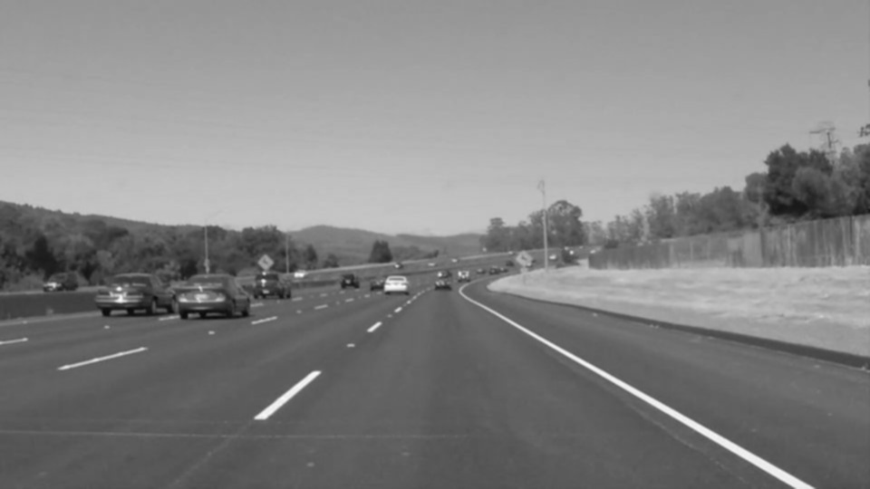
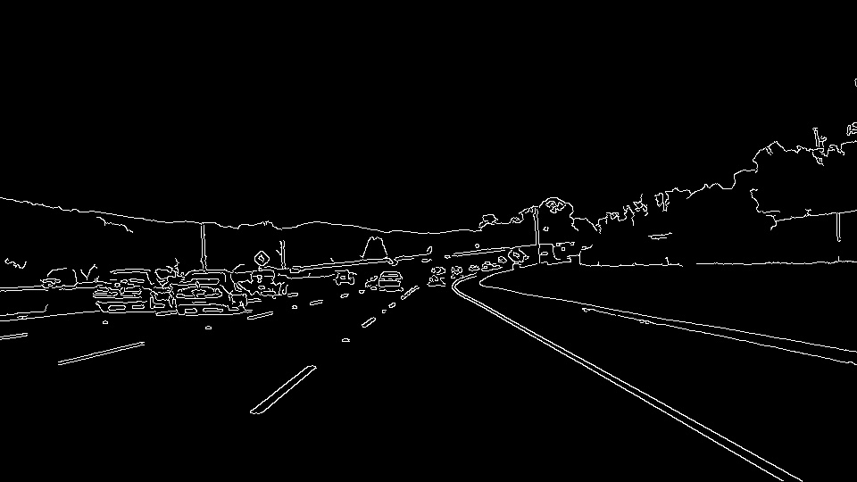
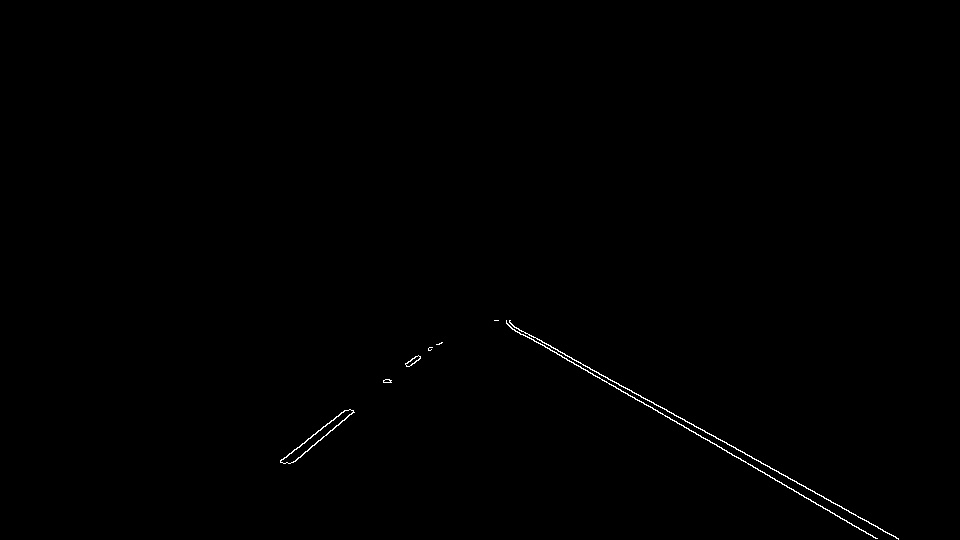
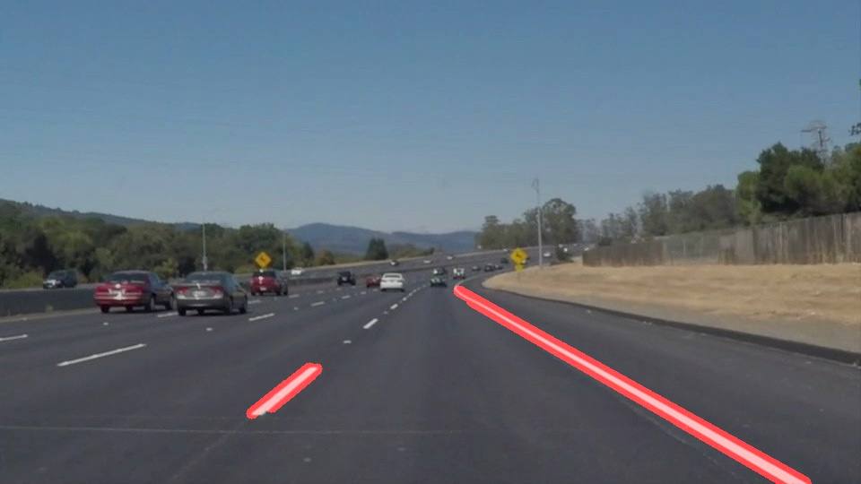
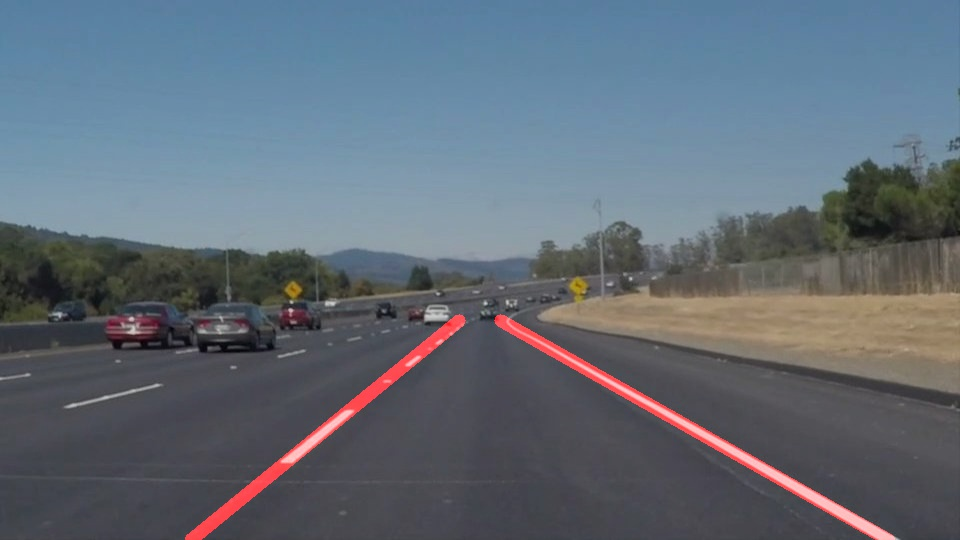

# **Finding Lane Lines on the Road** 

## Writeup

---

**Finding Lane Lines on the Road**

The goals / steps of this project are the following:
* Make a pipeline that finds lane lines on the road
* Reflect on your work in a written report
---

### Reflection

### 1. Describe your pipeline. As part of the description, explain how you modified the draw_lines() function.

My pipeline consisted of 5 steps. First, I converted the images to grayscale, then I used the guassian blur function. I detected the edges using the canny function and selected a polygon region for the hough lines function.

In order to draw a single line on the left and right lanes, I modified the draw_lines() function by finding the slope and midpoints of the lines detected. I then classified them to left lane lines and right lane lines. Slopes less than 0 corresponded to the left lane and greater than 0 corresponded to the right lane. I then found coordinates x1,y1,x2,y2 for the left lane and the right lane. I did this using the center and the slope that I calculated as the average of the slopes and centers calculated earlier. 

Example of how the pipeline works, using example - solidWhiteCurve.jpg:

Grayscale:

Applying Gaussian Blur:

Canny Edge Detection:

Region of Interest:

Lines Drawn (Hough):

After regression:

### 2. Identify potential shortcomings with your current pipeline

One potential shortcoming would be what would happen when the image was not 540 x 960. I have hardcoded a lot of the dimensions. This is probably not a good idea. Next time, I'd probably calculate proportions instead of putting in dimensions.

Another shortcoming could be that slopes and dips in the line would change the region required to be monitored quite a bit.

### 3. Suggest possible improvements to your pipeline

A possible improvement would be to draw lines better. The lines are not as accurate farthest from the x axis.

Another potential improvement could be to incorporate for curvy lanes, adding information of a previous frame might help predict where the next frame would be.
